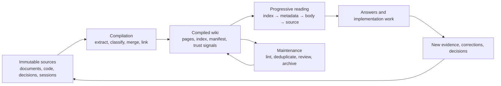

# Knowledge Compilation Handbook

This guide explains how to turn a growing collection of documents, code, decisions, and working notes into a durable knowledge system that an AI agent can use without rereading the entire source set on every task.

The central idea is simple:

> Compile knowledge when it enters the system; retrieve the compiled result when a question is asked.

The result is not a transcript archive, a search index, or a generated documentation dump. It is a maintained body of linked markdown whose pages state what something is, how it works, why a choice was made, how certain the claim is, and where supporting evidence can be checked.

## When this model fits

Use a compiled wiki when:

- the same domain knowledge is repeatedly rediscovered across sessions or projects;
- important context is split across code, design notes, decisions, and conversations;
- an agent needs a compact starting point but must still be able to inspect evidence;
- the knowledge should remain portable, reviewable, and usable without a hosted service;
- new evidence should strengthen or challenge existing pages instead of creating another disconnected note.

Use a different tool when the primary requirement is:

- an exact code call graph or symbol index — use language tooling or a code graph;
- verbatim conversation retention — use an archive or session store;
- low-latency search over uncurated material — use full-text or semantic search;
- secrets or credentials — use a dedicated secret manager;
- authoritative source publication — keep the original source system as the authority.

These tools can coexist. Search and code indexes help locate evidence; the wiki preserves the durable explanation produced from that evidence.

## The operating model

The system has three layers and one feedback loop.



### 1. Sources are evidence

Sources remain unchanged and retain their original authority. Typical inputs include:

- architecture and product documentation;
- source code, tests, schemas, and version history;
- decision records and review notes;
- operating procedures and incident findings;
- research papers, standards, and public references;
- agent sessions and working notes worth preserving.

Treat source selection as part of the design. A small set of high-signal documents plus the relevant code is usually a better first input than every file a team can find.

### 2. The wiki is the compiled artifact

The wiki contains deduplicated explanations, not copies of the inputs. Each page should be narrow enough to answer one coherent question and connected enough to reveal its surrounding context.

Compilation performs work that would otherwise be repeated at query time:

- remove boilerplate and repeated statements;
- separate fact from inference and uncertainty;
- merge compatible evidence into an existing page;
- preserve contradictions instead of silently choosing a side;
- route knowledge into the right category;
- create links to related pages;
- update the index and source-to-page manifest.

### 3. The maintenance contract is the schema

The schema is more than a directory layout. It is the set of rules that keeps the artifact trustworthy:

- required frontmatter and page templates;
- category and naming conventions;
- source and provenance rules;
- update, review, and archive workflows;
- limits on how much a single ingest may change;
- validation for links, tags, confidence, and stale content.

The default rules are defined by the skills and can be refined by a vault-level `AGENTS.md`.

## Model knowledge before choosing a folder

Three semantic forms cover most durable knowledge. Decide which question a page answers before selecting its storage category.

| Knowledge form | Primary question | Typical content | Natural category |
|-|-|-|-|
| Concept | How does it work? | mechanisms, flows, constraints, patterns | `concepts/` |
| Entity | What is it? | a tool, component, interface, person, or organization | `entities/` |
| Synthesis | Why this choice? | comparisons, trade-offs, decisions, cross-source conclusions | `synthesis/` |

The vault also supports operational categories that refine this core model:

| Category | Use it for | Avoid putting here |
|-|-|-|
| `skills/` | repeatable procedures and techniques | background theory without an action sequence |
| `references/` | factual lookups and self-contained source summaries | a conclusion assembled from several sources |
| `journal/` | time-bound observations and session notes | a durable explanation that should be merged elsewhere |
| `projects/` | project-scoped overviews and knowledge | a generally reusable concept |

The distinction prevents two common failures:

1. organizing only by platform or team, which mixes mechanisms, objects, and decisions in the same page; and
2. creating a page per input file, which preserves source boundaries instead of modeling the domain.

If one source contains an entity description, a workflow, and a design trade-off, compile it into separate linked pages. If two sources describe the same mechanism, merge them into one authoritative concept page.

## Define the first map deliberately

The first ingest establishes names and boundaries that later passes will reinforce. Before compiling a large source set:

1. list the domain's most important concepts and decisions;
2. identify which knowledge is global and which is project-specific;
3. choose a small controlled tag vocabulary;
4. define what must never enter the vault;
5. write one or two exemplary pages to establish the expected depth;
6. set a page limit for each ingest so the result stays reviewable.

A useful seed map names outcomes and mechanisms, not programming-language trivia. For a distributed system, for example, pages about request routing, retry policy, state transitions, and consistency choices are usually more valuable than pages listing every data-transfer object.

## The page contract

A compiled page should be useful in two modes: cheap preview and careful reading. Frontmatter powers preview and routing; the body carries the explanation and evidence.

```yaml
---
title: Retry Budget
category: concepts
tags: [reliability, networking]
aliases: [retry allowance]
relationships:
  - target: "[[synthesis/retry-vs-fail-fast]]"
    type: related_to
sources: [source://reliability-notes, source://client-policy]
summary: Bounds retry amplification by allocating attempts within a shared request budget.
provenance:
  extracted: 0.75
  inferred: 0.20
  ambiguous: 0.05
base_confidence: 0.72
lifecycle: draft
lifecycle_changed: 2026-08-04
tier: supporting
created: 2026-08-04T09:00:00Z
updated: 2026-08-04T09:00:00Z
---
```

The body should normally include:

- a one-paragraph definition;
- the mechanism or decision in enough detail to act on;
- invariants, limits, and failure modes;
- relationships to adjacent pages;
- open questions or contradictions;
- source references that can be checked by an authorized reader.

### Provenance and uncertainty

Claims copied or faithfully paraphrased from evidence are unmarked. Add `^[inferred]` to a connection or conclusion made during compilation. Add `^[ambiguous]` when evidence is incomplete, unclear, or contradictory.

This distinction matters more than a single confidence number. Readers need to know whether they are seeing evidence, synthesis, or unresolved uncertainty.

### Confidence and lifecycle

Confidence estimates evidence quality and coverage. Lifecycle records human review state. They are independent:

- `draft` — created or materially changed, not yet reviewed;
- `reviewed` — a person checked the structure and major claims;
- `verified` — material claims were checked against suitable evidence;
- `disputed` — credible evidence conflicts with the current page;
- `archived` — superseded or no longer active.

A page can have high-quality sources and still be a draft. A reviewed page can become stale when its sources change.

## The end-to-end workflow

### 1. Initialize the vault

```bash
pip install obsidian-wiki
obsidian-wiki setup --vault ~/brain
```

The setup creates the directory skeleton, configuration, index, log, hot cache, manifest, and agent skill links.

Before the first ingest, set source boundaries and review the core variables in [Configuration](configuration.md):

- `OBSIDIAN_VAULT_PATH` — compiled artifact location;
- `OBSIDIAN_SOURCES_DIR` — allowed source roots;
- `OBSIDIAN_CATEGORIES` — storage categories;
- `OBSIDIAN_MAX_PAGES_PER_INGEST` — reviewable batch size;
- `WIKI_STAGED_WRITES` — optional review queue for generated pages.

### 2. Compile a small, representative batch

```text
/wiki-ingest /path/to/high-signal-material
```

Review the first pages for category choice, naming, summary quality, provenance, depth, and links. Correct the pattern before scaling the batch. An agent will otherwise repeat a weak initial convention very efficiently.

Subsequent ingests should run incrementally. The manifest compares source identity and content state, skips unchanged inputs, and points changed sources back to the pages they previously affected.

### 3. Query progressively

```text
/wiki-query what constrains retries in the client path?
```

Querying follows an information ladder:

1. scan `index.md` for candidate pages;
2. read titles, tags, summaries, lifecycle, and provenance;
3. open only the most relevant page bodies;
4. follow typed relationships or `[[wikilinks]]` when the question crosses pages;
5. return to raw evidence for exact, freshness-sensitive, disputed, or high-risk claims.

This keeps routine questions compact without pretending the compiled page replaces the evidence.

### 4. Maintain the graph

Use maintenance skills as separate, reviewable passes:

```text
/wiki-status       # source delta, pending work, hubs, and structural gaps
/wiki-lint         # schema, links, staleness, contradictions, provenance drift
/wiki-dedup        # merge alternate names for the same subject
/cross-linker      # connect unlinked mentions to existing pages
/tag-taxonomy      # normalize the controlled vocabulary
/wiki-synthesize   # fill useful cross-page synthesis gaps
```

Separation matters. Ingest should focus on understanding and merging source material; a lint pass can then apply deterministic checks across the whole vault.

### 5. Review and promote

For sensitive or high-impact vaults, enable staged writes:

```env
WIKI_STAGED_WRITES=true
```

Generated pages land in `_staging/` until `/wiki-stage-commit` promotes them. Reviewers should focus on material claims, ambiguous sections, identity resolution, category choice, and information that should not be published.

### 6. Archive, rebuild, and export

Incremental maintenance is the default. Rebuild when taxonomy drift, duplicate structures, or outdated assumptions make repair more expensive than recompilation.

```text
/wiki-rebuild
/wiki-export
```

Rebuilds are snapshot-first so rollback remains possible. Exports are downstream artifacts; the markdown vault remains the editable source of truth for compiled knowledge.

## State files and their responsibilities

| File or directory | Responsibility | Update rule |
|-|-|-|
| `index.md` | human- and agent-readable catalog | update after every content change |
| `.manifest.json` | source identity, delta state, source-to-page mapping | update after ingest or source sync |
| `log.md` | chronological operation record | append after material operations |
| `hot.md` | compact recent-context snapshot | refresh after writes |
| `_meta/taxonomy.md` | controlled tag vocabulary | change deliberately, then normalize |
| `_insights.md` | derived graph observations | regenerate; do not treat as source evidence |
| `_staging/` | review queue | promote only after review |
| `_archives/` | rebuild and restore snapshots | immutable after creation |

Keeping these responsibilities separate prevents a generated report, transient cache, or old snapshot from being mistaken for current knowledge.

## Context economics

The benefit of compilation is not that every single page is always shorter than every source. The benefit appears when questions repeatedly cross source boundaries.

A raw workflow pays for discovery and source reading on every query:

```text
raw cost = locate candidates + read selected sources + reconcile overlap
```

A compiled workflow moves reconciliation to ingest time:

```text
compiled cost = scan index + preview candidates + read selected pages
```

As the source set grows, titles and summaries provide a decision layer that raw files do not have. The largest gains usually appear in two cases:

- a well-known core concept has a direct hub page; and
- a broad question requires combining many related sources.

Do not publish universal savings claims from one vault. Measure the local system instead:

1. choose five recurring questions of different breadth;
2. record files and approximate tokens read through the raw path;
3. record index, metadata, and page bodies read through the compiled path;
4. score answer correctness and evidence coverage, not cost alone;
5. repeat after the vault grows to detect whether routing remains stable.

Useful operating metrics include:

- source-to-page compression ratio;
- percentage of queries answered before raw fallback;
- number of pages opened per query;
- broken-link and orphan counts;
- stale or disputed core pages;
- duplicate concepts merged per maintenance cycle;
- percentage of material claims covered by reviewed evidence.

## Privacy-safe publication

A compiled wiki can reveal more than any single input because it connects facts. Publication therefore needs a separate review from ordinary content quality.

Before sharing or pushing a vault or guide:

1. remove credentials, access tokens, cookies, signed URLs, and private attachments;
2. replace personal names with roles unless identity is essential to the knowledge;
3. replace organization, project, repository, host, and environment names with stable neutral labels;
4. generalize exact traffic, cost, scale, date, and topology details when their precision could identify a system;
5. remove private issue links, document links, commit links, and source-system identifiers;
6. inspect screenshots and diagrams for names, account data, browser chrome, and hidden metadata;
7. keep any mapping from neutral labels to real systems outside the published artifact;
8. scan the final diff, filenames, git metadata, examples, and generated outputs — not only prose.

When evidence paths themselves are sensitive, use stable references such as `source://architecture-notes` in the published copy and keep the authorized mapping in a separate private ledger. Sanitization must not turn uncertainty into certainty: if removing detail weakens a claim, lower its confidence or mark it ambiguous.

Visibility tags help filter an existing vault, but they are not a substitute for sanitizing a public artifact. A public export should contain only material that is safe even if filtering fails.

## Production roles and cadence

A sustainable wiki separates responsibilities:

| Role | Responsibility |
|-|-|
| Domain curator | chooses source boundaries, seed concepts, taxonomy, and acceptance criteria |
| Agent | extracts, merges, links, updates state files, and proposes uncertainty markers |
| Reviewer | validates material claims, privacy, identity resolution, and lifecycle transitions |
| Consumer | queries the wiki and reports missing, stale, or misleading pages |

A practical cadence is event-driven plus periodic:

- after a material design or implementation change: incremental ingest or project update;
- during normal work: capture only reusable findings, not full transcripts by default;
- weekly or before a release: status, lint, staged-page review, and stale-core-page check;
- after a taxonomy or architecture shift: snapshot, rebuild evaluation, and regression queries.

Automated maintenance may prepare changes, but should not silently approve its own claims, erase source history, or publish sensitive material.

## Common failure modes

| Failure | Symptom | Correction |
|-|-|-|
| Notes accumulate without merging | many near-duplicate pages | run identity resolution; make ingest update existing pages first |
| Categories mirror teams or platforms | each page mixes definitions, workflows, and decisions | route by the question answered, then use tags/projects for scope |
| The wiki becomes an unreviewed summary | claims lack evidence or uncertainty markers | restore source links, provenance, confidence, and lifecycle review |
| Index grows into another long document | every query reads too much metadata | keep one-line summaries; use tags and project hubs for routing |
| Agent trusts compiled text blindly | stale or exact claims bypass source checks | require raw fallback for freshness-sensitive and high-risk work |
| Ingest rewrites too much | reviews become impossible | reduce page limits; use staged writes and incremental batches |
| Private facts leak through synthesis | no single source looked sensitive | run a publication-specific privacy review over the connected result |
| Rebuild destroys useful history | corrected pages cannot be recovered | snapshot before rebuild; keep archives immutable |

## Adoption checklist

Before calling a vault operational, verify that:

- [ ] its purpose and exclusions are written down;
- [ ] source roots are explicit and read-only;
- [ ] the first concept, entity, synthesis, and procedure pages set a good standard;
- [ ] every page has summary, sources, provenance, confidence, and lifecycle metadata;
- [ ] manifest entries map sources to pages using canonical identifiers;
- [ ] index, log, and hot cache update after writes;
- [ ] queries use index → metadata → body → source progression;
- [ ] contradictions and uncertain claims remain visible;
- [ ] lint, deduplication, taxonomy, and stale-page reviews have an owner and cadence;
- [ ] rebuilds create recoverable snapshots;
- [ ] public outputs pass a dedicated privacy and source-trace scan;
- [ ] a small regression question set still produces correct, cited answers after changes.

The goal is not to generate the most pages. It is to make the smallest maintainable knowledge graph that reliably helps a reader or agent understand the domain, verify important claims, and avoid rediscovering the same conclusions.
